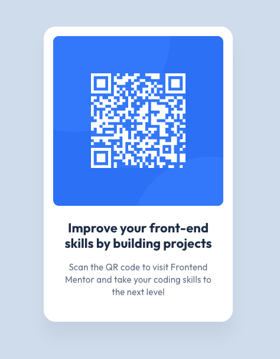

# Frontend Mentor - QR code component solution

This is a solution to the [QR code component challenge on Frontend Mentor](https://www.frontendmentor.io/challenges/qr-code-component-iux_sIO_H). Frontend Mentor challenges help you improve your coding skills by building realistic projects.

## Table of contents

- [Overview](#overview)
  - [Screenshot](#screenshot)
  - [Links](#links)
  - [Built with](#built-with)
  - [Author](#author)
  - [Available Scripts](#available-scripts)

**Note: Delete this note and update the table of contents based on what sections you keep.**

## Overview

### Screenshot

### Links

- Solution URL: [Add solution URL here](https://github.com/0s0ka/cata-qr-code-component.git)
- Live Site URL: [Add live site URL here]()

### Built with

- Semantic HTML5
- CSS/SCSS
- React
- TypeScript
- [react-qr-code](https://www.npmjs.com/package/react-qr-code) - React library

### Author

- Website - [Luv Osokina](https://github.com/0s0ka)
- Frontend Mentor - [@0s0ka](https://www.frontendmentor.io/profile/0s0ka)

### Available Scripts

In the project directory, you can run:

#### `npm start`

Runs the app in the development mode.\
Open [http://localhost:3000](http://localhost:3000) to view it in the browser.
